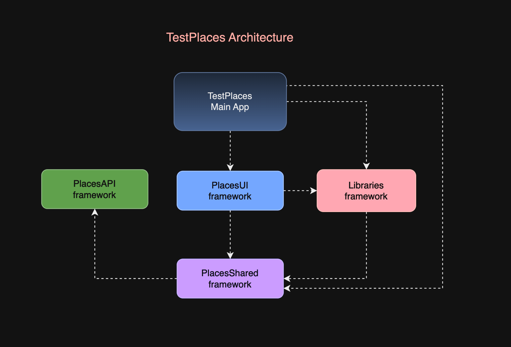

# TestPlaces Application

## Introduction

The TestPlaces application is a simple iOS app designed to list various places and display details for each place. The app is partially complete, with version 0.5 available for reference. The goal is to finish the implementation of the Places List and Place Details features, along with some refactoring and additional enhancements.

## Task

### Objective

Finish the TestPlaces application by completing the remaining functionalities, including search functionality for the Places List, displaying Place Details, and some refactoring for better modularity and testability.

### Source Code

- [TestPlacesApp_V.0.5.zip](https://drive.google.com/file/d/1G0ls3ERFEv6Wfq5al3HzZ38Hc1Y2rJ5S/view?usp=sharing)
- [Video Capture of Version 0.5](https://drive.google.com/file/d/13VOOfRZDI1t_5q5tQai3JWltscGKrF2a/view?usp=sharing)

### Final Version Comparison

- [Video of Version 1.0 (V1) Functionality](https://drive.google.com/file/d/1OoFh2F_NWgeWdjQcv1A0XLgkbwnJgoj7/view?usp=sharings)

### Requirements

#### 1. Finish the Places List Implementation

- Complete the Search functionality.
- Ensure the list is sorted by text.
- Use animations for UI transitions.
- Add 10-20 different places for better testing.
- Refer to the V1 video for exact requirements.

#### 2. Finish the Place Details Implementation

- Display the Place Details view when a table row is clicked.
- Show the place name and coordinates in the details view.
- Show a map with a marker for the selected place.
- Use animations for UI transitions.
- Refer to the V1 video for exact requirements.

#### 3. Refactor the Project

- Extract “API” (logic layer) and “UI” (user interface) modules into separate frameworks, similar to “Libraries” (reusable components).
- Add unit tests to the `TSPlaceInfo` class.
- Ensure all classes are inheritable and extensible.

### Additional Requirements

- No third-party libraries.
- No Interface Builder.
- Adhere to the current project coding conventions.
- Use reusable project components if available.
- Add documentation comments to the code.

## Installation

1. **Download the Source Code**: Download the provided `TestPlacesApp_V.0.5.zip` file and unzip it.

2. **Open the Project in Xcode**: Open the `TestPlaces.xcodeproj` file in Xcode.

3. **Build and Run**: Build and run the project on your desired simulator or device.

## Usage

- **Places List**: View a list of places, use the search bar to filter places, and click on a place to view details.
- **Place Details**: View detailed information about a selected place, including its name, coordinates, and location on a map.

## Architecture

## License

This project is licensed under the MIT License.

